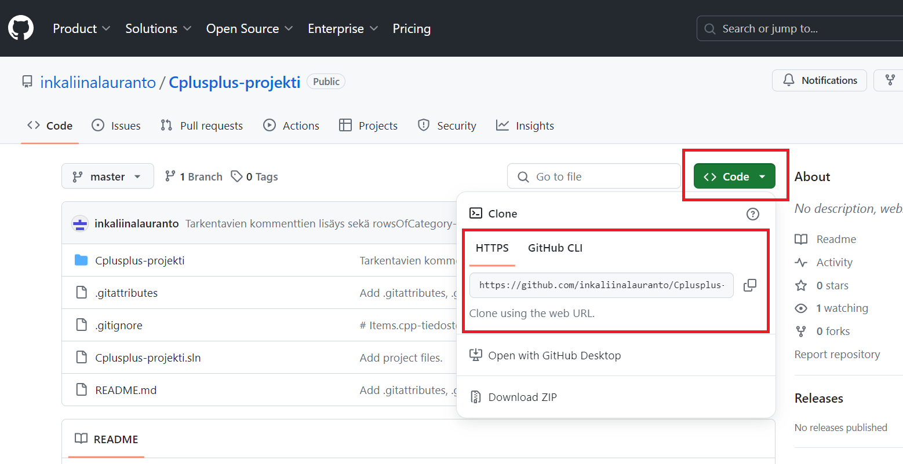
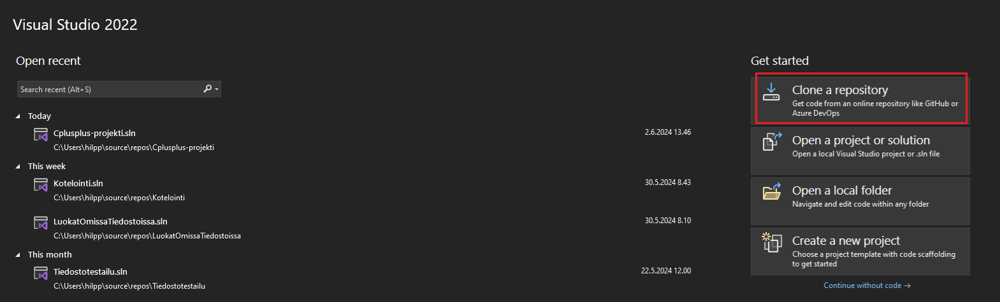
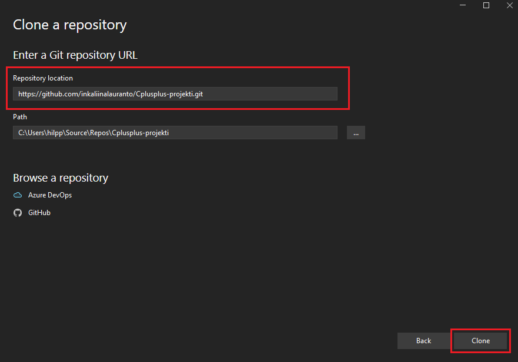
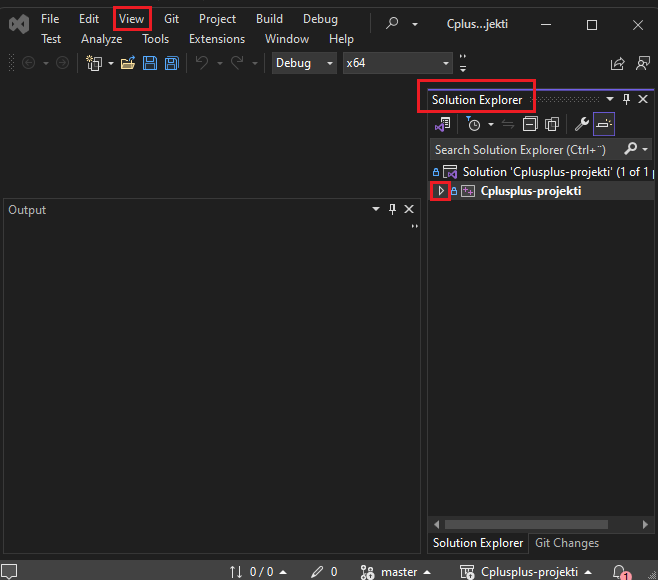
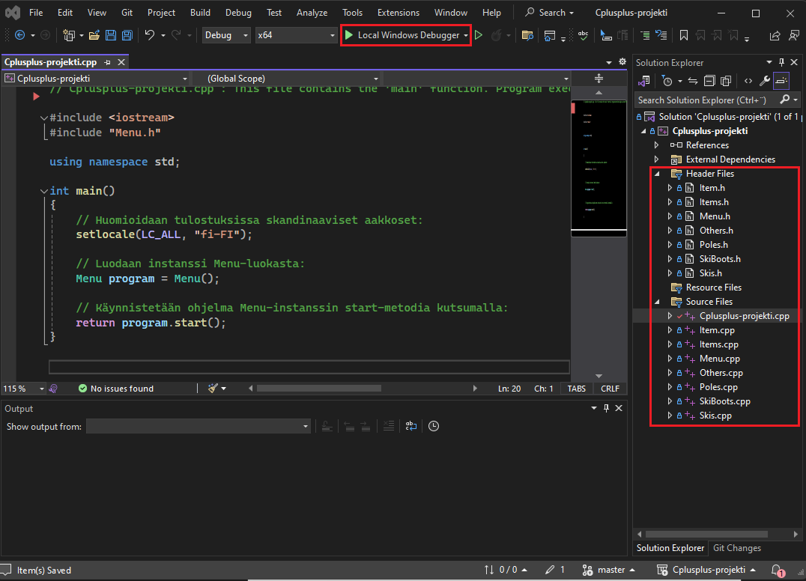
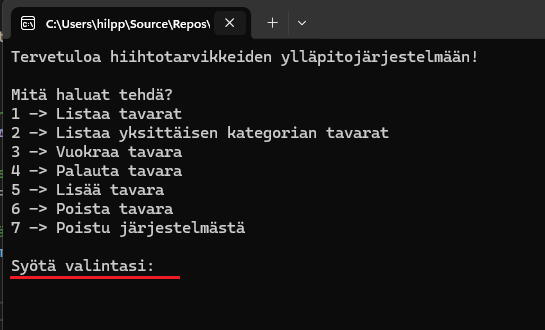

# Cplusplus-projekti

## Projektin kuvaus:

Projektin lopputuote on yksinkertainen hiihtotarvikkeiden ylläpitojärjestelmä, jossa tavarat voi listata kokonaisuudessaan tai kategorioittain, niitä voi vuokrata ja palauttaa sekä lisätä ja poistaa. Käyttöliittymänä projektissa toimii komentokehoiterajapinta, joka ohjaa käyttäjää koko järjestelmän käynnissäoloajan.

Koodin puolella on Cplusplus-projekti.cpp-niminen pääohjelma, jossa hyödynnetään Menu-luokasta tehtyä instanssia. Menu-luokan lisäksi ohjelmaan kuuluvat Item-luokka, Items-luokka, jossa tehdään instansseja Item-luokasta, sekä Items-luokasta periytyvät Others-, Poles-, SkiBoots- ja Skis-luokat. 

Jokaisessa luokassa koodi on jaettu pienempiin osiin jäsenfunktioiksi. Lisäksi periytyvissä luokissa hyödynnetään perittyjä funktioita sekä ylikirjoitettavaa perittyä funktiota. Useassa luokassa käytetään C++ -kielen standardikirjastoja, kuten vector-, string-, iostream- ja fstream-kirjastoja. Ohjelma on kommentoitu yksityiskohtaisesti.

## Projektin tarkasteleminen Visual Studio Community 2022 -editorilla (Windows-käyttöjärjestelmällä):

- Jos käytät QT Creatoria, siirry seuraavan linkin takana olevaan repositorioon ja seuraa ko. repositorion README-tiedostosta löytyviä ohjeita: www..

- Kopioi leikepöydälle repositorion URL "<> Code"-napista avautuvan pikku ikkunan HTTPS-otsikon alapuolella olevasta kentästä:

- Avaa Visual Studio Community 2022 ja valitse oikeasta sivusta Get Started -otsikon alta "Clone a repository":

- Liitä leikepöydälle kopioitu URL-osoite Clone a repository -otsikolla avautuneen ikkunan Repository location -kenttään. Path-kenttä täyttyy automaattisesti. Paina sen jälkeen oikeasta alakulmasta nappia Clone:

- Avautuvasta projekti-ikkunasta pääset tutkimaan mm. lähde- ja otsikkotiedostoja Solution Explorerin kautta laajentamalla Cplusplus-projekti-valikkoa nuolen kuvasta. Jos Solution Explorer ei aukea valmiiksi, sen saa auki joko näppäinyhdistelmällä Ctrl + Alt + L tai ylävalikon kautta painamalla View-kohtaa. Klikkaa valikon ensimmäistä vaihtoehtoa eli Solution Exploreria:

- Otsikko- ja lähdetiedostot löytyvät kansioiden Header Files ja Source Files alta. Tiedostoja tuplaklikkaamalla saa ne avattua editoriin.
- Projektin saa ajettua vihreästä nuolisymbolista, jonka vieressä lukee "Local Windows Debugger", tai vaihtoehtoisesti Ctrl + F5 -näppäinyhdistelmällä:

- Kun käynnistysnappia on painettu, aukeaa käyttöliittymärajapintana komentokehoite. Nyt ohjelman käyttö onnistuu komentokehoitteen kirjallista opastusta seuraamalla.
- Kun poistut ohjelmasta eli syötät valinnaksi merkin 7, muista sulkea komentokehoite. Muuten ohjelman ajaminen uudestaan ei onnistu.

