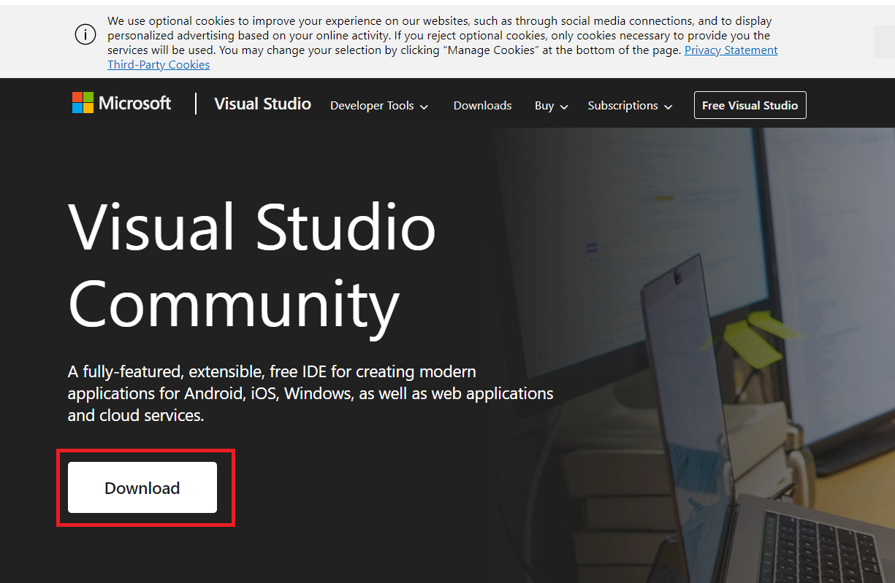
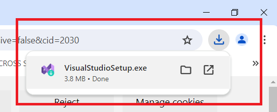
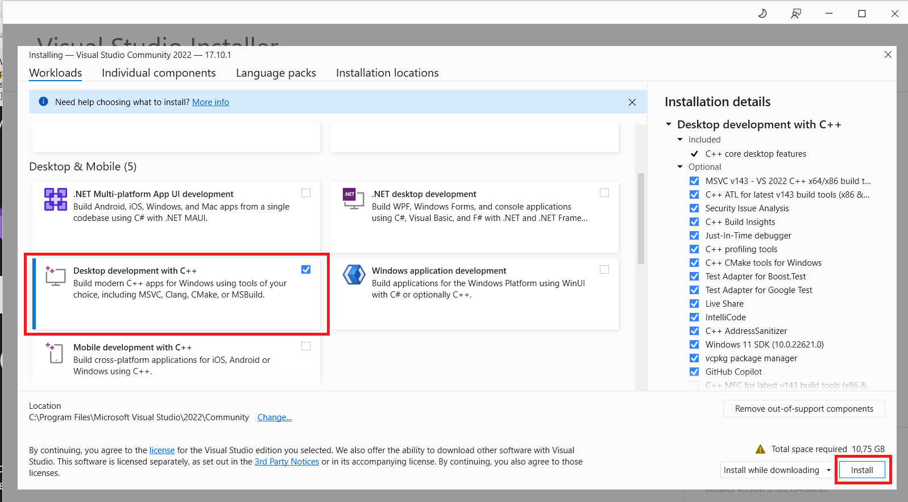
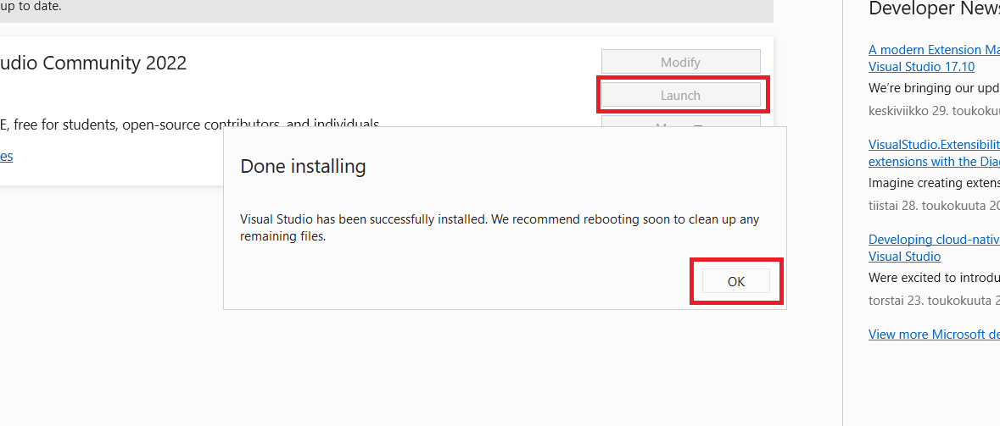
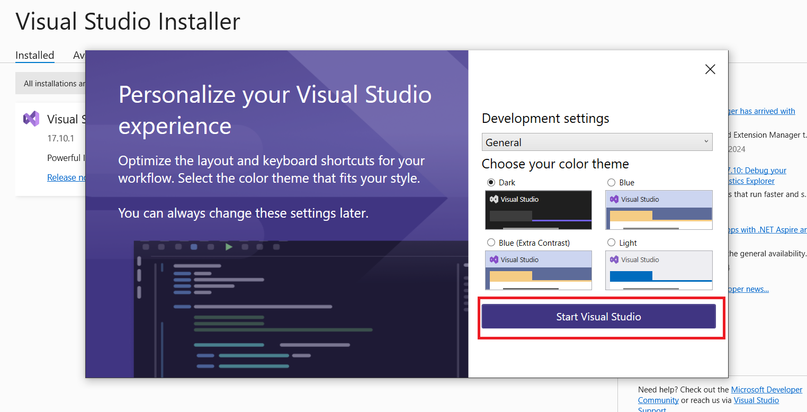

## Visual Studio 2022 Community -IDE:n asentaminen

- Navigoi osoitteeseen https://visualstudio.microsoft.com/vs/community/ ja paina etusivun Download-nappia:

- Avaa Downloads-kansioon latautunut VisualStudioSetup.exe-tiedosto:

- Salli Visual Studio Installerin tehdä muutoksia, jos avaamisen yhteydessä ilmestyy ponnahdusikkuna, jossa asia halutaan varmistaa.
- Tämän jälkeen voi ilmestyä toinen ponnahdusikkuna, jonka otsikko on Visual Studio Installer, ja jossa sanotaan, että ennen konfiguroimisen aloittamista on tehtävä muutama asia. Paina ikkunan Continue-nappia.
- Valitse avautuvasta näkymästä Dektop development with C++ -vaihtoehto ja paina Install-nappia:

- Kun lataus on valmis, paina Done installing -ponnahdusikkunan OK-nappia ja sen alla olevan ikkunan Launch-nappia:

- Tämän jälkeen Sign in Visual Studio -otsikolla olevasta ikkunasta voi valita vaihtoehdon Skip this for now.
- Personalize your Visual Studio Experience -ikkunasta voit valita mieleisesi väriteeman, minkä jälkeen paina Start Visual Studio:

Nyt Visual Studio -IDE käynnistyy käyttövalmiiksi C++ -ohjelmille.